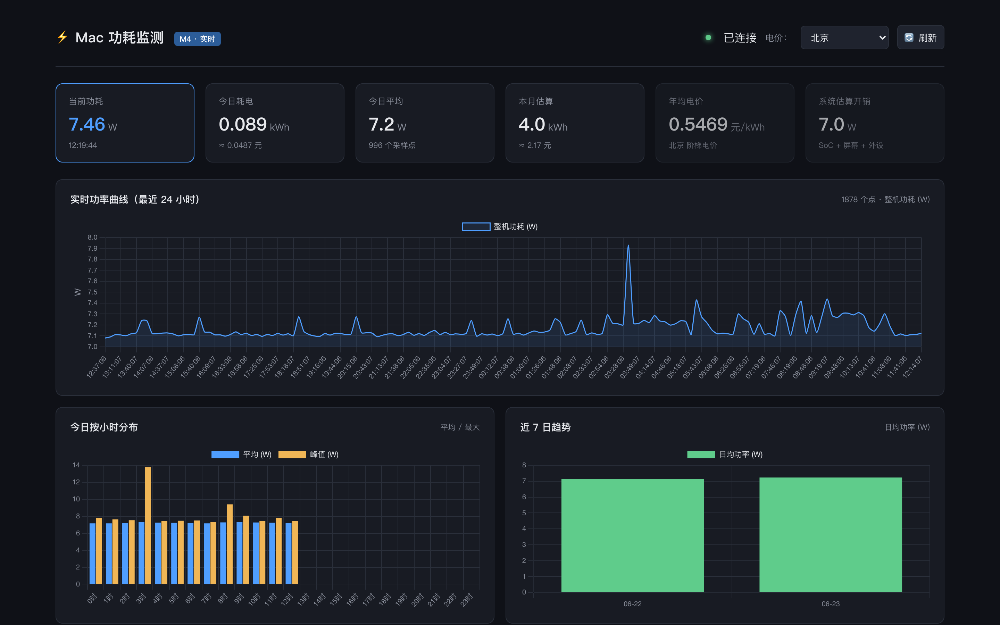
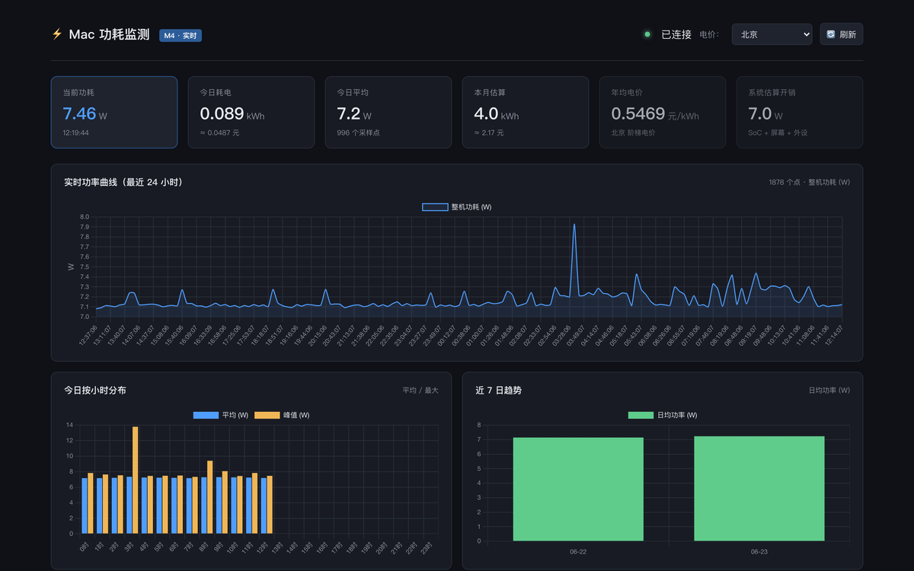
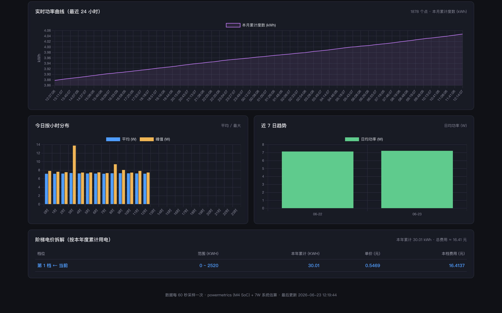

# Mac 功耗监测面板

把 Mac 的实时功耗数据变成可视化仪表盘，按中国阶梯电价估算电费，可通过外网访问。

[English](./README.md) | [在线演示](https://hubianluanma.com/power/) | [博客文章](https://blog.hubianluanma.com/posts/mac-power-monitor/)

## 截图

**主仪表盘** — KPI、24h 实时曲线、按小时分布、近 7 日趋势:

<div align="center">
  
</div>

**KPI 卡片可点击交互** — 点 4 张高亮卡片切换实时曲线显示的指标(整机功耗/今日累计度数/5 点滑动平均/本月累计度数)。另外 2 张无时间序列的卡片点击会弹 toast:

<div align="center">
  
</div>

**阶梯电价拆解** — 按本年度累计用电自动落到对应档位(北京/上海/广州/深圳):

<div align="center">
  
</div>

## 特性

- ⚡ **实时采样** —— 每分钟调一次 `powermetrics`，解析 CPU/GPU/ANE 三段功耗
- 📊 **Web 仪表盘** —— 24h 实时曲线、按小时分布、近 7 日趋势（Chart.js，单 HTML 文件）
- 💰 **阶梯电价** —— 北京/上海/广州/深圳居民用电阶梯电价自动估算
- 🌐 **外网访问** —— 提供 nginx 反代 + Cloudflare Tunnel 配置示例
- 📦 **零依赖部署** —— 不需要数据库服务（SQLite），不需要构建步骤
- 🪶 **轻量** —— Python + HTML 合计不到 800 行

## 快速开始

```bash
# 1. 安装依赖
python3 -m venv venv
source venv/bin/activate
pip install -r requirements.txt

# 2. 配置 sudoers（一次性，下面有详细步骤）
# 3. 启动采集器
python3 scripts/collector.py
# 4. 启动 Web 仪表盘（另一个终端）
python3 scripts/web.py
# 5. 浏览器打开 http://127.0.0.1:7654/power/
```

## 安装详解

### 环境要求

- **macOS**（推荐 Apple Silicon，`powermetrics` 是 macOS 独占工具）
- **Python 3.9+**（在 3.11 和 3.14 上测试通过）
- **`sudo`** 权限（用于一次性配置 `powermetrics`）

### 第 1 步：免密 sudo

`powermetrics` 需要 root 权限。每分钟采一次让人输密码不现实：

```bash
sudo tee /etc/sudoers.d/powermetrics <<EOF
$(whoami) ALL=(root) NOPASSWD: /usr/bin/powermetrics
Defaults!/usr/bin/powermetrics !logfile, !syslog
EOF

sudo chmod 0440 /etc/sudoers.d/powermetrics

# 验证（不应该提示密码）
sudo -n /usr/bin/powermetrics -i 1000 -n 1 --hide-cpu-duty-cycle | head -20
```

> ⚠️ **安全提示**：`!logfile, !syslog` 防止 syslog 被高频采样刷屏。`NOPASSWD` 限定到 `powermetrics` 路径，不是完整 root。

### 第 2 步：配置系统估算偏移

`powermetrics` 只给 SoC package 的功耗（CPU+GPU+ANE），**不含屏幕、SSD、USB、Wi-Fi、DRAM、电源损耗**。需要加一个 `SYSTEM_BIAS_W` 估算项：

| 机型 | 推荐值 |
|---|---|
| M4 Mac mini（桌面机，无屏幕） | 7 W |
| M4 MacBook Pro 14" 闲置 | 10-12 W |
| M4 MacBook Air 闲置 | 8-10 W |
| 满载跑 AI 推理（加屏幕） | +12 W |

通过环境变量覆盖：
```bash
export SYSTEM_BIAS_W=10
```

> 💡 **怎么验证你设的值对不对**：用万用表或智能插座测整机功耗，跑满负载时跟仪表盘数字对比，差值就是你要找的 SYSTEM_BIAS_W。

### 第 3 步：启动

```bash
# 终端 1：采集器
SYSTEM_BIAS_W=7 python3 scripts/collector.py

# 终端 2：Web 仪表盘
SYSTEM_BIAS_W=7 python3 scripts/web.py
# → 打开 http://127.0.0.1:7654/power/
```

## 配置项

所有配置通过环境变量：

| 变量 | 默认 | 说明 |
|---|---|---|
| `SYSTEM_BIAS_W` | `7.0` | 系统外设功耗估算 (W) |
| `PORT` | `7654` | Web 服务端口 |
| `SCRIPT_PREFIX` | `/power` | URL 前缀（部署到根路径时设 `""`）|

## 架构

```
┌─────────────────────┐
│ powermetrics (sudo) │  ← 每分钟采样 5 秒
└──────────┬──────────┘
           ↓
┌─────────────────────┐
│ SQLite 单文件 DB    │  ← data/power.db
└──────────┬──────────┘
           ↓
┌─────────────────────┐
│ Flask @ 127.0.0.1   │  ← 端口 7654
└──────────┬──────────┘
           ↓ proxy_pass /power/
┌─────────────────────┐
│ nginx（可选）        │  ← 反向代理
└──────────┬──────────┘
           ↓
┌─────────────────────┐
│ Cloudflare Tunnel   │  ← HTTPS 终止
└──────────┬──────────┘
           ↓
     浏览器（手机 / 桌面）
```

## API

所有接口返回 JSON，路径前缀由 `SCRIPT_PREFIX` 控制（默认 `/power`）：

| 接口 | 说明 |
|---|---|
| `GET /power/api/summary?city=beijing` | KPI 摘要（当前功耗，今日/本月/本年 kWh + 成本）|
| `GET /power/api/samples?hours=24` | 原始采样点（最近 N 小时）|
| `GET /power/api/hourly` | 今日按小时聚合 |
| `GET /power/api/cities` | 支持的城市和电价档位 |

## 外网访问

完整 nginx 配置见 [`examples/nginx.conf`](./examples/nginx.conf)。如果用 Cloudflare，**必须加 Cache Rule**：

- URL pattern: `<your-domain>/power/api/*`
- Setting: Cache Level = **Bypass**

否则 CF 会缓存 `/api/summary` 的 JSON 30 秒左右，仪表盘不实时。

## 局限

- **仅 macOS** —— Windows/Linux 没有 `powermetrics`
- **成本估算** —— `powermetrics` 不报屏幕和外设功耗，必须加 `SYSTEM_BIAS_W` 估算。实际精度 ±15%
- **无认证** —— 外网暴露时需要自己加 nginx basic auth 或 Cloudflare Access
- **SQLite 够个人用** —— 多用户场景需要换 PostgreSQL / TimescaleDB

## 项目背景

起因是想给常年开机的 M4 Mac mini 估电费，做完后顺手开源。完整实现故事见博客：[从 powermetrics 到外网可视化仪表盘](https://blog.hubianluanma.com/posts/mac-power-monitor/)

## License

MIT © 2026 [Spiral](https://github.com/hubianluanma)